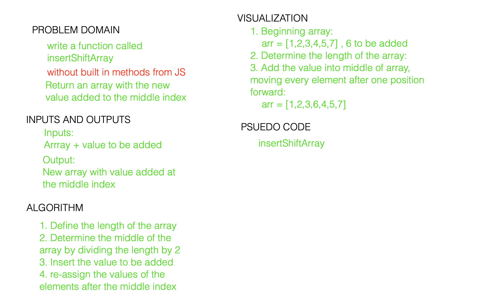

# Array Shift Code Challenge #02

Pair programmed with Ben Hill 

WIP- This code challenge was attempted from 915-1015p, and is currently incomplete. Will be trying again at a later date. 

## Problem Domain

Write a function called insertShiftArray which takes in an array and the value to be added. Without utilizing any of the built-in methods available to your language, return an array with the new value added at the middle index.

## Algorithm
- Define the length of the array
- Determine the middle of the array 
- Insert the value to be added
- Re-assign the values of the elements after the middle index to make room for the added value

## Resources

