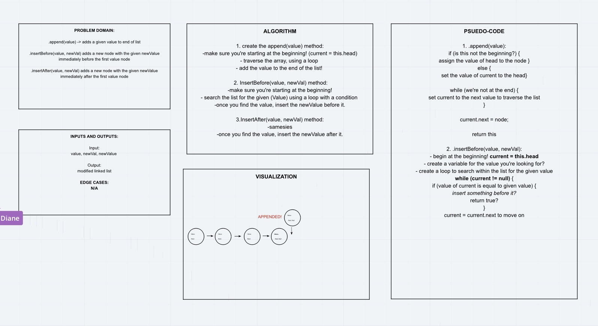

# Challenge Summary

## Challenge Description
- .append(value) which adds a new node with the given value to the end of the list
- .insertBefore(value, newVal) which add a new node with the given newValue immediately before the first value node
- .insertAfter(value, newVal) which add a new node with the given newValue immediately after the first value node

## Approach & Efficiency
- The big O for this is O(n), since we do not now how many variables will be within the list.

## Solution
